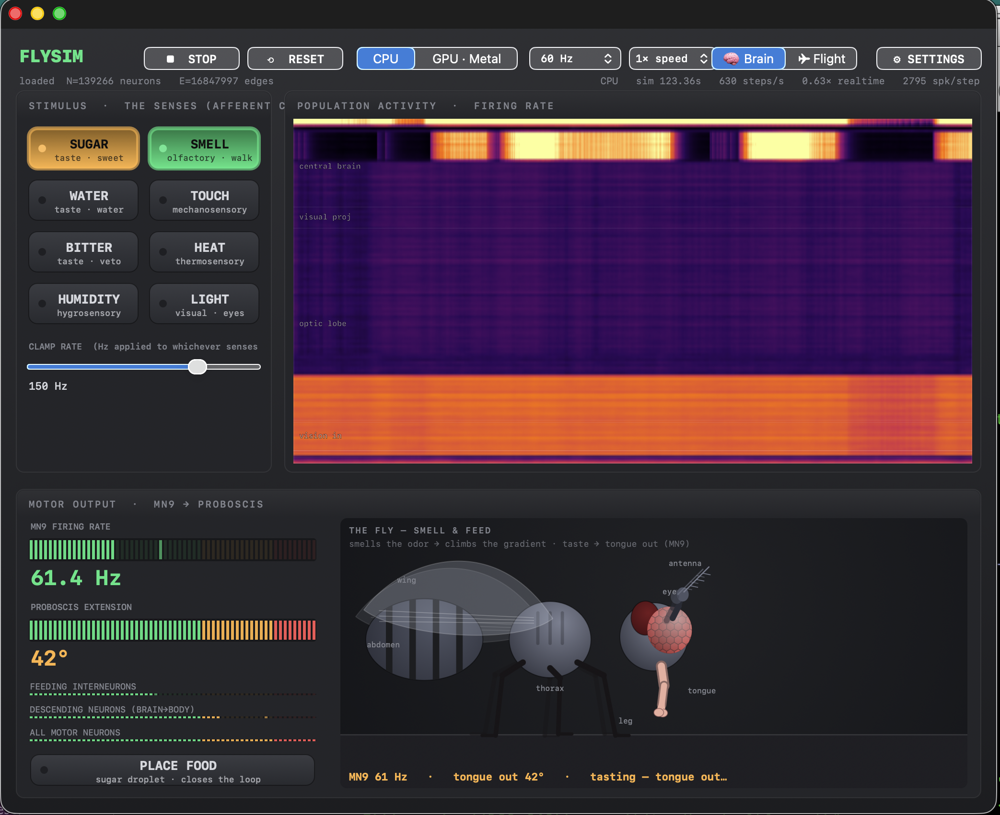
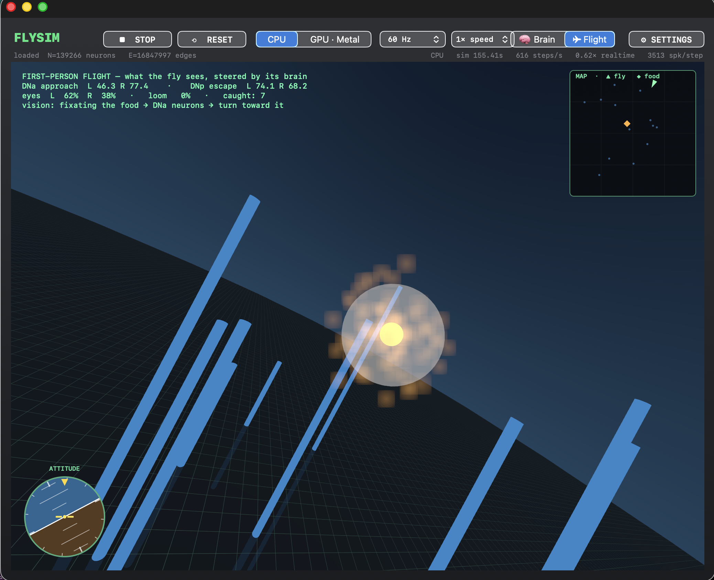
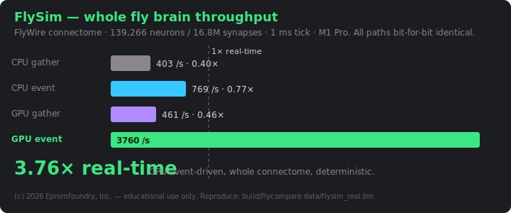

<!-- FlySim  ·  (c) 2026 mikewolak@gmail.com / Epromfoundry, Inc.  All rights reserved. -->
<!-- Educational & academic research use only — commercial use prohibited.  See LICENSE. -->
# FlySim

A connectome-driven *Drosophila* brain simulator: the FlyWire whole-brain
connectome (139,266 neurons / 16.8M synapses) run as a leaky integrate-and-fire
network on Apple Silicon, with a native Cocoa GUI and a full MCP control plane.
See `FLYSIM_BUILD.md` for the design.



Drive any of the fly's **senses** (taste · smell · touch · heat · humidity ·
vision — every one a tagged afferent population from the real connectome) and
watch every **output** (MN9 / motor neurons / descending command neurons) fire
in real time. Place a drop of sugar and the animated fly **smells its way to it**
— climbing the odor gradient with its antennae (real olfactory ORN firing), then
extending its proboscis to drink once it tastes it. Drag the food and it turns
around and re-finds it. Every sense produces a **visible reaction**: light buzzes
the wings, touch startles, heat makes it recoil, bitter is rejected as aversive.

### The activity strip reads as information flow

The scrolling heatmap is **ordered by processing stage**, not file order: sensory
afferents at the bottom → optic lobe → central brain → descending → motor at the
top. Clamp one sense and *its* band lights, then the signal propagates **up** to
the motor rows. **Hover any band** for what it is — e.g. *"optic lobe · visual
processing — 77,539 neurons (55.7%)"*. More than half the fly brain is vision.

### Flight view — the fly flies itself, steered by its connectome



Switch to the **Flight** tab for a first-person 3D view of the fly navigating to
food — and it's the *brain* doing the flying, not a scripted path:

- **Vision + smell → approach.** Food bearing drives the left/right photoreceptors
  and olfactory ORNs; the real **DNa steering descending neurons** (the anterior
  turn cluster) read out left/right and bank the fly toward the target.
- **Looming → escape.** A pillar that's close and ahead stimulates the
  photoreceptors on its side; the brain's **DNp escape cluster** (DNp01 giant
  fiber + the loom-sensitive DNs) fires asymmetrically and **veers the fly away**.
- Net heading = DNa-toward − DNp-escape. A gyro attitude indicator and a top-down
  minimap track the flight; the horizon banks into turns but stays upright.

## Performance — the whole fly brain, faster than life

**3.76× biological real-time** for the entire 139k-neuron / 16.8M-synapse
connectome at a 1 ms tick, on an M1 Pro laptop.



| config | steps/sec | × real-time | agreement |
|---|--:|--:|---|
| CPU · dense gather (8 threads) | 403 | 0.40× | bit-exact |
| CPU · event-driven | 769 | 0.77× | bit-exact |
| GPU · dense gather (warp) | 461 | 0.46× | bit-exact |
| **GPU · event-driven** | **3,760** | **3.76×** | **bit-exact** |

Real-time = 1,000 steps/s (1 ms tick). The event-driven path scatters only from
the ~2.5 % of neurons that spike each step instead of touching all 16.8M synapses.
Every backend accumulates in Q14 fixed-point integers, so CPU, GPU, gather and
scatter are **bit-for-bit identical** (`max|Δrate| = 0`) — order-independent and
fully reproducible. Regenerate with `build/flycompare data/flysim_real.bin`.

## Layout

- `src/` — the C99 LIF core (`flysim.c`), on-disk format, public API, and the
  Metal GPU backend (`flysim_metal.m`).
- `tools/` — `flypack` (synthetic connectome), `convert_flywire.py` (real data →
  `flysim.bin`), `flydrive` (headless smoke test), `flycompare` (CPU vs GPU
  perf+accuracy → HTML).
- `app/` — `FlySim.app`: Cocoa panel + `FlyController` (sim thread) +
  `FSControlServer` (HTTP/JSON "MCP" surface on 127.0.0.1:7777).

## Backends (all bit-for-bit identical)

The synaptic gather accumulates in **Q14 fixed-point integers**, so results are
independent of thread count / reduction order. CPU (multi-thread), GPU-scalar,
and GPU-warp all produce identical trajectories (`flycompare`: corr 1.000000).

## Getting the real connectome

The dataset is **not** in this repo (≈0.85 GB, and it carries its own license).
One command downloads it and packs `data/flysim_real.bin`:

```sh
./tools/fetch_data.sh
```

That fetches, from their public sources:

| file | what | source |
|---|---|---|
| `proofread_connections_783.feather` (~852 MB) | per-pair edges: `pre, post, syn_count`, NT probabilities | Zenodo [10676866](https://zenodo.org/records/10676866) |
| `Supplemental_file1_neuron_annotations.tsv` (~25 MB) | per-neuron `flow / super_class / cell_class / cell_sub_class / cell_type / nt / side` | [flyconnectome/flywire_annotations](https://github.com/flyconnectome/flywire_annotations) |

then runs `tools/convert_flywire.py` (needs `pyarrow` + `pandas`, auto-installed)
to transpose them into the mmap-ready CSC binary the runtime loads. Sugar/water
GRNs (gustatory `sugar/water`), bitter GRNs, and the proboscis `MN9` readout
(the motor neurons most driven by sugar) are tagged during the pack.

**No download?** A self-contained synthetic connectome reproduces the full
pipeline (sugar → MN9 reflex, all backends) offline:

```sh
clang -std=c99 -O2 tools/flypack.c -o build/flypack && build/flypack synth data/flysim.bin
```

> The FlyWire / FAFB connectome is **not** covered by the FlySim license. It is
> subject to FlyWire's terms; please cite Dorkenwald et al. (Nature 2024) and
> Schlegel et al. (Nature 2024). See `FLYSIM_BUILD.md §1` and `LICENSE §4`.

## Build & run

```sh
# 1. data — real connectome (or `build/flypack synth data/flysim.bin` for synthetic)
./tools/fetch_data.sh

# 2. the app (links Metal)
make -C app run

# 3. headless CPU-vs-GPU report
clang -std=c99 -O2 -c src/flysim.c -o build/flysim_cpu.o
clang -O2 -fobjc-arc -c src/flysim_metal.m -o build/flysim_metal.o
clang -std=c99 -O2 tools/flycompare.c build/flysim_cpu.o build/flysim_metal.o \
      -framework Metal -framework Foundation -lm -o build/flycompare
build/flycompare data/flysim_real.bin 150 200 300 build/flysim_compare.html
```

## Senses in, motor out

Every sensory class in the connectome is tagged and clampable, and every output
population is readable — so an LLM (or `curl`) can drive any input and watch any
output close the loop:

| in (afferent clamp) | population | out (readout) | population |
|---|--:|---|--:|
| `sugar` / `water` taste | 129 | `mn9` proboscis motor | 12 |
| `bitter` taste | 65 | `feeding` interneurons (sugar→MN9 premotor) | 40 |
| `smell` (olfactory ORNs) | 2,282 | `motor` (all motor neurons) | 110 |
| `touch` (mechanosensory) | 2,671 | `descending` (brain→body) | 1,303 |
| `heat` (thermo) · `humidity` (hygro) | 29 · 74 | `DNa` steering (approach, L/R) | 56 |
| `light` (photoreceptors R1-6/R7/R8) | 11,385 | `DNp` escape (loom/giant-fiber, L/R) | 326 |

The **feeding interneurons** are the hop-1 premotor stage — neurons excited by
sugar GRNs that in turn drive MN9 — tagged during the pack; clamp sugar and the
meter tracks it live. (Bitter GRNs are cholinergic here, so this connectome
subset shows no measurable feeding *veto* — bitter is presented as aversive, not
as a false inhibition.)

## MCP

With the app running, `curl 127.0.0.1:7777/tools` lists every control. Highlights:

```sh
curl 127.0.0.1:7777/data/sensory                 # all senses in (Hz)
curl 127.0.0.1:7777/data/motor                   # mn9 / motor / descending out
curl 127.0.0.1:7777/data/populations             # every clampable population + size
curl -XPOST 127.0.0.1:7777/tool/clamp -d '{"modality":"smell","hz":150}'
curl -XPOST 127.0.0.1:7777/tool/clamp_set -d '{"kind":"superclass","name":"descending"}'
curl -XPOST 127.0.0.1:7777/tool/food  -d '{"on":true}'   # drop sugar; the fly hunts it
curl 127.0.0.1:7777/data/behavior                # the fly: walking/arrived/feeding
curl 127.0.0.1:7777/data/steering                # DNa approach + DNp escape, L/R/turn
curl -XPOST 127.0.0.1:7777/tool/light_lr -d '{"left":180,"right":20}'  # bias the eyes
curl -N 127.0.0.1:7777/stream?hz=60              # watch everything live (SSE)
```
